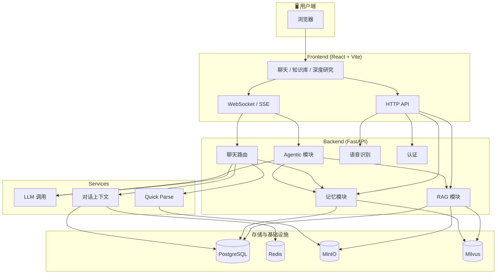

# AIWeb 🚀

## 🎯 体验模块

**在线体验**：[https://personalaiweb.top](https://personalaiweb.top)

在浏览器中直接体验多模型聊天、长期记忆、RAG 知识库、Agentic 工具调用与 DeepResearch 深度研究等完整能力。
测试用账户：xingjianglong2025@163.com
测试用密码：123456

---

## 快速导航

- 项目概览：功能、架构、目录、Roadmap
- 本地启动：`infra` → `backend` → `frontend`
- 模块文档：
  - `backend/README.md`
  - `frontend/README.md`
  - `backend/rag/README.md`
  - `backend/memory/README.md`
  - `backend/agentic/README.md`
  - `backend/agentic/deepresearch/README.md`
  - `backend/db/README.md`
  - `backend/infra/README.md`
  - `infra/README.md`

一个面向个人与小团队的全栈 AI 工作台。  
前端基于 React + Vite，后端基于 FastAPI，整合「聊天 / 记忆 / 知识库 / 文件解析」等能力，帮你在本地或私有环境里搭建**自己的 AI 助手控制台**。😎

> 如果你觉得「只用一个浏览器 tab」就能管理模型、记忆、RAG 和文件，那大概就是这个项目想给你的感觉。

### 主程序架构图



## ✨ 功能概览

- 💬 **多模型聊天**
  - 支持多家 OpenAI 兼容模型（如 OpenAI、DeepSeek、Qwen 等）
  - WebSocket 流式输出，代码块高亮，支持复制按钮

- 🧠 **分层长期记忆模块（`backend/memory`）**
  - 使用 Milvus + PostgreSQL 做混合记忆检索
  - 重要性打分 + 时间衰减 + 反思压缩
  - 自动召回「用户偏好 / 关键决策 / 长期项目背景」这类高价值信息
  - **记忆管理**：用户可在侧栏/菜单中打开「记忆管理」浮窗，查看、添加、编辑、删除记忆；编辑时触发重新向量化

- 🎤 **语音转文字输入**
  - 支持浏览器 Web Speech API（安全上下文下）或云端 ASR 降级：前端录音上传，后端转 MP3 后调用 Qwen3-ASR-Flash 转写；需配置 `DASHSCOPE_API_KEY` 或 `QWEN_API_KEY`，非 MP3/WAV 需安装 ffmpeg

- 📎 **Quick Parse 文件解析（聊天下的临时文件上传）**
  - 前端通过 MinIO 上传文件，在输入框 & 聊天记录中展示**文件预览卡片**
  - 后端用 `services/quick_parse.py` 将 PDF / Word / Excel / CSV / TXT 解析为 Markdown 文本
  - 解析结果只作为当前轮对话的「工作记忆」，**不会写入长期记忆或知识库**
  - 有 Token 粗略估算与截断，避免一不小心把上下文吃爆
  - 每次使用 Quick Parse，都有浅提示告诉你：如需长期/多轮使用，请上传到知识库

- 📚 **RAG 知识库**
  - 独立 RAG 页面（wiki/search）：上传文档 → MinerU/多格式解析 → 版面感知切块 → Dense+Sparse 向量化 → 三段式检索（精确+FTS+RRF+Reranker）
  - 与聊天结合：勾选知识源后提问，召回 chunk 注入上下文，AI 基于检索结果回答；右侧展示召回卡片（表格/图片/公式富文本）、展开文件可定位高亮
  - 来源指南：文档总结入库（大文档截断后生成），展开文件弹窗内展示
  - **笔记本 emoji**：由 DeepSeek 根据名称生成，失败时关键词兜底；emoji 存库（`notebooks.emoji`），列表返回，刷新不重复请求
  - **上传反馈**：同笔记本重复上传返回 409；不支持的文件类型返回 400，前端展示「重复上传」「不支持格式」等提示；解析中可打开「解析等待」弹窗玩贪吃蛇

- 🧩 **Agentic 模式 & 工具调用（`backend/agentic`）**
  - ReAct 状态机：token 级流式（`stream_delta`、`observation_delta`）+ Thought / Action / Observation / Final Answer，全程通过 `/api/agentic/ws` 推送事件，并将完整 trace 持久化到会话消息中
  - 工具系统：内置工具（`user_memory`、`knowledge_search`、`web_search`、`data_analyzer`、`chart_generator`）、Skills 系统（`backend/agentic/SKILLS`）、MCP 集成（支持静态 MCPTool 与通过 `mcp_manager.discover_and_register_mcp_tools` 动态发现的 RemoteMCPTool）
  - 多 Agent：支持 Supervisor-Worker 路由（`WorkerTool`），由 Supervisor 决定调用哪组 Worker 工具；前端在聊天页提供 Agentic 开关与推理面板，基于事件流回放推理过程，并对 `chart_generator` 输出进行 ECharts 图表渲染

- 🔎 **DeepResearch 深度研究（`backend/agentic/deepresearch`）**
  - 独立于普通聊天的研究会话流：规划章节 → 等待用户确认 → 继续研究 → 汇总成文 → 审核与导出 PDF
  - 后端以 SSE 推送 `phase`、`outline`、`search_result`、`section_content`、`report_draft`、`research_complete` 等事件，前端提供步骤条、章节编辑、局部改写和历史恢复
  - 数据单独落到 `research_sessions` 表系，和聊天会话 `conversations/messages` 分开管理

- 🧱 **基础运维与基础设施集成**
  - `infra/docker-compose.yml` 一键拉起 PostgreSQL / Redis / MinIO / Milvus / RabbitMQ / Elasticsearch 等依赖服务
  - 提供调试路由：Redis / Postgres / RabbitMQ / Elasticsearch 等健康检查

---

## 🗂 目录结构（简要）

- `frontend/`：前端 React 应用（对话页 / 知识库页 / 登录注册等）
- `backend/`：FastAPI 后端
  - `routers/chat.py`：聊天主路由（含 WebSocket）
  - `routers/asr.py`：语音识别（上传音频 → 转 MP3 → Qwen3-ASR-Flash）
  - `routers/memory.py`：记忆管理 HTTP API（列表 / 新增 / 编辑 / 删除）
  - `services/llm_service.py`：LLM 统一调用封装
  - `services/chat_context.py`：对话上下文读取与持久化（Redis + Postgres）
  - `memory/`：长期记忆模块（打分 / 向量检索 / 遗忘 / 反思）
  - `infra/minio/`：对象存储上传、预签名 URL 生成
  - `services/quick_parse.py`：Quick Parse 文件解析逻辑
  - `db/`：数据库建表脚本与说明
  - `agentic/`：Agentic 模式（ReAct + Tool Calls + Skills + MCP），详见 `backend/agentic/README.md`
  - `infra/`：后端 Infra 适配（Redis / Postgres / MinIO / Milvus / RabbitMQ / Elasticsearch 等）

- `infra/`：Docker Compose 基础设施（MinIO, Redis, PostgreSQL, Milvus, Attu, RabbitMQ, RedisInsight, pgAdmin, Elasticsearch, Kibana）

---

## 🔄 实现流程与技术流程概览

### 请求与数据流（整体）

1. **用户发起对话（主聊天页）**
   - 前端：`useChat` → WebSocket `/api/chat/ws` 发送消息（含 `model_id`、`conversation_id`、可选 `rag_context`、`quick_parse_files`）。
   - 后端：`routers/chat.py` 接收 → 解析会话与历史（Redis/PostgreSQL）→ 意图路由与记忆召回（`memory.retrieve_relevant_memories`）→ 拼 system（长期记忆 + 知识库上下文 + Quick Parse 内容）→ 调用 `LLMService.chat()` 流式返回。
   - 落库：`chat_context.persist_round` 写 messages 表，异步触发 `memory.extract_and_store_memories_for_round` 写入/反思。

2. **RAG 检索与回答（wiki/search 页）**
   - 前端：用户勾选知识源后输入问题 → 先请求 `POST /api/rag/search`（`document_ids` 仅包含勾选文档）→ 用 `buildRAGContextFromHits` 拼上下文 → 再通过 WebSocket 发同一问题并带上 `rag_context`。
   - 后端：RAG 检索三路召回（精确 + Sparse + Dense）→ RRF 融合 → Reranker 精排 → 返回 hits；聊天侧将 `rag_context` 注入 system，LLM 基于检索内容回答。

3. **文档入库（RAG）**
   - 上传：`POST /api/rag/documents/upload` → 同笔记本重复返回 409，不支持格式返回 400 → SHA-256 防重/秒传 → MinIO 存储 → `documents` 表。
   - 解析：`POST /api/rag/documents/{id}/process` → MinerU（或本地/pdfplumber）/多格式解析 → Block 规范化 → 图片上传 MinIO + 可选 VLM → 版面感知切块（Parent-Child）→ PostgreSQL 全量切片 + 仅 Child 向量化写入 Milvus；前端解析中可显示「解析等待」弹窗（含贪吃蛇小游戏）。

4. **展开文件与来源指南**
   - `GET /api/rag/documents/{id}/markdown` 返回 `filename`、`segments`（含 `chunk_id`）、`summary`；无 summary 时后端截断内容调用 LLM 生成并入库，前端弹窗内定位到对应 chunk 并高亮。

### 技术栈与分层

| 层级 | 技术 | 职责 |
|------|------|------|
| 前端 | React 18, Vite, WebSocket | 路由、聊天 UI、RAG 知识源/检索卡片、Markdown+公式渲染、主题与 i18n |
| 网关/API | FastAPI | 路由、CORS、OpenAPI/Swagger、认证占位 |
| 对话与上下文 | chat router, chat_context, LLMService | 会话解析、历史持久化、Prompt 组装、流式输出 |
| 记忆 | memory 模块 | 打分写入、混合召回（语义+时间衰减+重要性）、反思与遗忘 |
| RAG | rag 模块 | 上传/解析/切块/向量化、三段式检索、来源指南总结 |
| 存储 | PostgreSQL, Redis, MinIO, Milvus | 用户/会话/消息/记忆/文档与切片、缓存、对象存储、向量 |

---

## 🧱 功能依赖矩阵

不同能力依赖的基础设施并不完全相同，第一次搭项目时建议先看这一节：

| 能力 | 最低依赖 | 额外模型 / 服务 | 说明 |
|------|----------|-----------------|------|
| 普通聊天 | 后端 + 前端 + 至少一个可用 LLM Key | PostgreSQL、Redis 强烈推荐 | 没有数据库也能调通部分接口，但历史恢复、标题生成、状态恢复会明显受限 |
| 认证 / 历史会话 | PostgreSQL | JWT 配置 | 登录注册、会话列表、消息持久化都依赖 PostgreSQL |
| Quick Parse | MinIO | 解析模型 Key、`ffmpeg`（语音相关场景） | 临时文件上传到 MinIO，解析结果只注入当前轮上下文 |
| 长期记忆 | PostgreSQL + Milvus | `QWEN_API_KEY`、`DEEPSEEK_API_KEY` | Qwen 负责 embedding，DeepSeek 负责打分 / 路由 / 反思 |
| RAG | PostgreSQL + MinIO + Milvus | `QWEN_API_KEY`，可选 `JINA_API_KEY`、MinerU | 文档上传、解析、切块、向量化、检索全链路都依赖对象存储与向量库 |
| Agentic | 普通聊天依赖 + Agentic 路由 | `SERPER_API_KEY` 或 `BOCHA_API_KEY`（联网搜索） | 工具调用、MCP、数据分析和图表生成在这一层打开 |
| DeepResearch | Agentic 依赖 + `research_sessions` 表 | `DEEPSEEK_API_KEY`，可选联网搜索与本地知识库 | 默认固定使用 `deepseek-v3.2`，不是普通聊天的 `model_id` 直通模式 |

如果你想最快跑通整套能力，最省事的方式仍然是先启动 `infra/docker-compose.yml`。

---

## 🚀 快速开始（本地开发）

### Windows 一键启动

如果你在 Windows + PowerShell 环境下，希望由脚本自动提示输入 API Key、生成 `backend/.env`、启动基础设施并拉起前后端，可以直接在项目根目录执行：

```powershell
.\start-services.ps1 start
```

脚本会：

- 交互式提示输入 `DEEPSEEK_API_KEY`、`QWEN_API_KEY`，并可选录入 `OPENAI_API_KEY`、联网搜索 Key
- 自动对齐 `backend/.env` 中的 MinIO / Postgres / Redis / Milvus 连接配置
- 自动启动 `infra/docker-compose.yml` 中的核心服务
- 执行 `python -m db.run_schema`
- 分别打开后端和前端窗口，方便直接看日志

其他常用命令：

```powershell
.\start-services.ps1 status
.\start-services.ps1 stop
.\start-services.ps1 restart
.\start-services.ps1 logs
```

1. 克隆仓库并进入项目目录：

   ```bash
   git clone <your-repo-url>
   cd AIWeb
   ```

2. 启动基础设施（强烈推荐）：

   ```bash
   cd infra
   docker compose -f docker-compose.yml up -d
   ```

   说明：
   - 这会拉起 PostgreSQL、Redis、MinIO、Milvus，以及若干调试面板。
   - `attu` 默认占用宿主机 `8000`，如果你准备让后端跑 `8000`，请先停掉 `attu`、修改端口映射，或让后端改跑其他端口。
   - `minio` 在 `infra/docker-compose.yml` 里的默认账号是 `Eddiex / 12345678`，首次复制 `backend/.env.example` 时请同步填写 `MINIO_ACCESS_KEY` 与 `MINIO_SECRET_KEY`。

3. 启动后端：

   ```bash
   cd backend
   # 首次部署：复制 .env.example 为 .env，按需填写 API Key、数据库等
   pip install -r requirements.txt
   python -m db.run_schema              # 首次：建表（需 PostgreSQL 已启动）
   python main.py
   # 或 uvicorn main:app --host 0.0.0.0 --port 8000 --reload
   ```

   可选系统依赖（见 `backend/requirements.txt` 顶部注释与 `backend/README.md`）：**ffmpeg**（云端语音识别 webm→MP3）、**ngrok / cloudflared**（内网穿透 / MinerU 外部 API 访问本地 MinIO）。

4. 启动前端：

   ```bash
   cd frontend
   npm install
   npm run dev
   ```

5. 访问前端（默认）：

   - `http://localhost:5173/`（推荐：localhost 下麦克风等权限可用；若用 `http://本机IP:5173` 会显示 Not secure，无法使用语音输入）

6. 按顺序验证：

   - 打开 `http://localhost:8000/docs`，确认后端已正常启动
   - 注册一个账号并登录
   - 聊天页先测试普通对话
   - 再进入 `/wiki` 测试 RAG 上传与解析
   - 最后进入 `/deep-research` 测试规划与继续研究流程

**首次部署建议**：
- 在 `backend` 目录将 `.env.example` 复制为 `.env`，优先填好 `OPENAI_API_KEY` / `DEEPSEEK_API_KEY` / `QWEN_API_KEY` 这几类关键模型配置。
- 若直接使用仓库自带的 `infra/docker-compose.yml`，记得把 `.env` 里的 MinIO 账号改成 compose 中的实际值：`Eddiex / 12345678`。
- **无需配置 ngrok 即可本地使用**；仅当使用 [mineru.net](https://mineru.net) 云端解析 PDF 时，才需要把本机 MinIO 通过 ngrok / cloudflared 暴露公网并配置 `MINIO_PUBLIC_ENDPOINT`，详见 `backend/rag/README.md`。

---

## 🗺 Roadmap / TODO

- [x] 对话历史持久化
- [x] 长期记忆模块
- [x] 聊天下的 Quick Parse 文件上传与解析
- [x] 知识库 RAG 工作流（上传 / 解析 / 切块 / 向量化 / 三段式检索 / 来源指南）
- [x] RAG 与聊天结合（勾选知识源、召回注入、卡片展示与展开定位高亮）
- [x] 记忆管理（列表 / 新增 / 编辑 / 删除，编辑触发重新向量化）
- [x] 语音转文字输入（Web Speech API + 云端 Qwen3-ASR-Flash 降级）
- [x] 联网搜索
- [x] 深度搜索功能及页面
- [x] mcpRemote接口
- [ ] macLocal接口
- [ ] 用户认证与多用户隔离（JWT 占位已接入，多用户隔离完善中）
- [ ] 使用统计与配额（请求次数 / Token 用量）
- [ ] 个人中心页面优化
- [ ] RAG 系统更多格式文件支持及测试
- [ ] RAG 功能优化
- [ ] skill接口权限与执行边界待完善
- [ ] 临时对话

