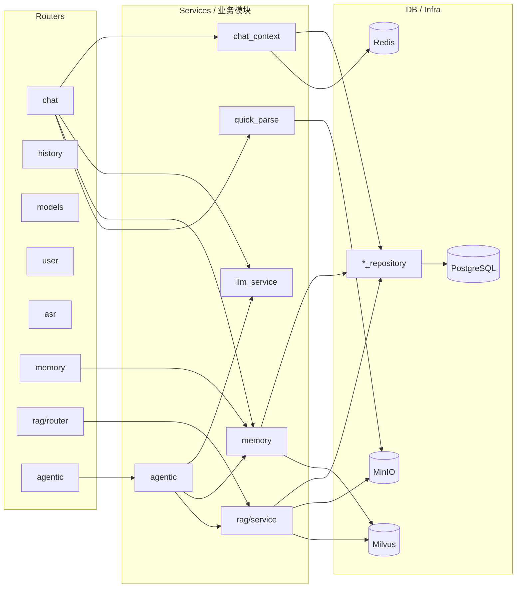

# AIWeb Backend 🧠

## 快速导航

- 能力概览：多模型聊天、记忆、RAG、ASR、认证
- 快速启动：安装依赖 → 运行服务 → 打开 Swagger
- 关键模块：`routers/`、`services/`、`memory/`、`rag/`、`agentic/`
- 相关文档：
  - `backend/rag/README.md`
  - `backend/memory/README.md`
  - `backend/agentic/README.md`
  - `backend/agentic/deepresearch/README.md`
  - `backend/db/README.md`
  - `backend/infra/README.md`

基于 FastAPI 构建的多模型 LLM 聊天服务后端，是整个 AIWeb 的「中枢神经」。  
负责把模型、记忆、RAG、文件解析、用户体系这些能力都串起来。

### 后端架构图



## ✨ 功能特性

- 🤖 **多模型支持**
  - OpenAI (GPT-4, GPT-4o, GPT-3.5-turbo)
  - Anthropic (Claude 3)
  - DeepSeek
  - 通义千问 (Qwen)
  - Moonshot (Kimi)
  - 智谱 AI (GLM)
  - 自定义 OpenAI 兼容接口
- 🔑 **灵活的 API Key 管理**
- 💬 **流式 / 非流式对话**
- 🧠 **长期记忆模块（memory）集成**
- 📎 **Quick Parse 文件解析（MinIO + 长上下文模型）**
- 🔌 **OpenAI 兼容接口设计**（/api/chat, /api/models 等）
- 🎤 **语音识别（ASR）**：`POST /api/asr/transcribe`，浏览器上传音频（如 webm），后端转 MP3 后调用 Qwen3-ASR-Flash；需 `DASHSCOPE_API_KEY` 或 `QWEN_API_KEY`，非 MP3/WAV 需 ffmpeg
- 🧠 **记忆管理 API**：`GET/POST/PUT/DELETE /api/memory/*`，支持列表、新增、编辑、删除记忆；编辑时重新计算 embedding
- 🔐 **JWT 认证**：登录签发 token，`backend/.env` 中 `JWT_SECRET`、`JWT_EXPIRE_SECONDS` 等
- 🧩 **Agentic 模式（ReAct + 工具调用）**：`/api/agentic/ws` token 级流式（`stream_delta`、`observation_delta`）+ Thought / Action / Observation / Final Answer，`/api/agentic/chat` 非流式；内置工具：`user_memory`、`knowledge_search`、`web_search`、`data_analyzer`、`chart_generator`；支持 SkillTool（`backend/agentic/SKILLS`）与 MCP 工具（`/api/agentic/mcp-servers` 与 `/api/agentic/mcp-servers/add`）
- 🔎 **DeepResearch**：`/api/agentic/deepresearch/*` 基于 SSE 的深度研究链路，支持章节规划、用户确认、继续研究、历史恢复、局部改写与 PDF 导出；研究会话落在独立的 `research_sessions` 表系

## 🚀 快速开始

### 1. 安装依赖

`requirements.txt` 已包含运行与 RAG/记忆/Quick Parse 所需 Python 依赖。复制 `.env.example` 为 `.env` 后执行：

```bash
cd backend
pip install -r requirements.txt
```

可选：需本地 BGE-M3 稀疏向量时取消注释并安装 `FlagEmbedding`。

**系统/外部依赖（非 pip 包，按需安装）：**

| 工具 | 用途 | 安装示例 |
|------|------|----------|
| **ffmpeg** | 语音识别（ASR）：浏览器上传 webm 时，后端用 pydub 将音频转为 MP3 再调用 Qwen3-ASR-Flash；未安装时云端语音识别会报「音频转 MP3 失败」 | Windows: `winget install ffmpeg`<br>macOS: `brew install ffmpeg`<br>Linux: `apt install ffmpeg` / `yum install ffmpeg` |
| **ngrok** | 将本机后端暴露到公网（内网穿透），便于移动端访问、远程调试或接收 Webhook | 下载 [ngrok](https://ngrok.com/)，或 `winget install ngrok` / `brew install ngrok`，运行 `ngrok http 8000` 获得公网 URL |

# 使用venv环境命令行
.\.venv\Scripts\Activate.ps1

### 2. 建表与启动服务（后端）

首次运行前，先确保 PostgreSQL 已启动，然后执行：

```bash
python -m db.run_schema
```

`db.run_schema` 会按顺序创建用户、会话、记忆、RAG、DeepResearch 相关表；当前新库初始化**不再需要**额外执行单独的补列迁移脚本。

**Windows 推荐不用 `--reload`**（否则 uvicorn 父子进程可能导致请求到不了应用，出现 404/无响应、终端无日志）：

```bash
python main.py
# 或

uvicorn main:app --host 0.0.0.0 --port 8000
```

也可在 backend 目录执行 `.\run.ps1`。

需要热重载时再使用 `--reload`（若出现访问无响应，请改回上述方式）。

如果你已经启动了 `infra/docker-compose.yml` 的完整面板集合，需要注意 `Attu` 默认占用宿主机 `8000`。此时可以：

- 暂时停掉 `Attu`
- 修改 `infra/docker-compose.yml` 中 `Attu` 的端口映射
- 或让后端改跑 `8001` / 其他端口

### 3. 访问 API 文档（Swagger / ReDoc）

- Swagger UI: `http://localhost:8000/docs`
- ReDoc: `http://localhost:8000/redoc`

你可以把后端当成标准的「OpenAI 风格 API」，也可以直接在 Swagger 里玩。😄

## 🧱 最小依赖矩阵

| 能力 | 必需依赖 | 补充说明 |
|------|----------|----------|
| 登录 / 会话 / 历史 | PostgreSQL | 不接 PostgreSQL 时，用户体系与历史恢复不可用 |
| 普通聊天 | 至少一个可用模型 API Key | 建议同时启用 PostgreSQL + Redis，便于恢复流与历史 |
| Quick Parse | MinIO | 只影响聊天下的临时文件上传与解析 |
| 长期记忆 | PostgreSQL + Milvus + `QWEN_API_KEY` + `DEEPSEEK_API_KEY` | Qwen 做 embedding，DeepSeek 做重要性打分 / 路由 / 反思 |
| RAG | PostgreSQL + MinIO + Milvus + `QWEN_API_KEY` | 可选接入 MinerU、Jina Reranker、图片 VLM |
| Agentic | 普通聊天依赖 + 可用工具配置 | 联网搜索依赖 `SERPER_API_KEY` 或 `BOCHA_API_KEY` |
| DeepResearch | Agentic 依赖 + `research_sessions` 表 | 当前固定使用 `deepseek-v3.2`，并非把前端 `model_id` 原样透传到底层 |

---

## 🔄 实现流程详解

### 对话请求全流程

1. **前端**：建立 WebSocket 连接 `ws://host/api/chat/ws?token=...`，发送 JSON：`{ "message", "model_id", "conversation_id?", "rag_context?", "quick_parse_files?" }`。
2. **后端** `routers/chat.py`：
   - 解析 `conversation_id`，从 Redis 或 PostgreSQL 拉取历史消息（`services/chat_context.py`）。
   - 若未传 `conversation_id` 则创建新会话并回写前端。
   - **意图路由**：调用 `memory.get_intent_domains(user_input)` 得到领域，用于记忆过滤。
   - **记忆召回**：`memory.retrieve_relevant_memories(user_id, query, ...)`，三维混合打分（语义 + 时间衰减 + 重要性），取 Top-K 拼入 system 的【长期记忆】块。
   - **RAG 上下文**：若请求体带 `rag_context`，拼入 system 的【知识库检索】块。
   - **Quick Parse**：若有 `quick_parse_files`，MinIO 拉取后 `services/quick_parse.py` 解析为 Markdown，拼入 system，仅当轮有效。
   - 调用 `LLMService.chat(messages)` 流式生成，按 SSE 格式回推前端。
   - 流结束后 `chat_context.persist_round` 写 messages 表，并 `asyncio.create_task(extract_and_store_memories_for_round(...))` 异步写入/反思记忆。

### RAG 检索与文档流水线

- **检索**：`POST /api/rag/search`（body：`notebook_id`, `query`, `document_ids?`）。仅勾选的知识源参与召回（`document_ids` 为空则无结果）。三路召回 → RRF → Reranker → Parent-Child 溯源，详见 `backend/rag/README.md`。
- **文档**：上传 → 同笔记本重复返回 **409**，不支持的文件类型返回 **400**（前端可解析 `detail` 做「重复上传」「不支持格式」提示）→ SHA-256 防重/秒传 → MinIO；`/process` 触发解析（MinerU 或多格式）→ Block 规范化 → 图片上传+VLM 可选 → 版面感知切块 → PostgreSQL 存全量切片，仅 Child 做 Dense+Sparse 向量化写 Milvus。来源指南：`GET /documents/{id}/markdown` 若无 summary 则截断内容调 LLM 生成并入库。
- **笔记本 emoji**：`POST /api/rag/emoji-from-title`（body：`title`）根据名称用 DeepSeek 生成 emoji，失败时关键词兜底；`PATCH /api/rag/notebooks/{id}/emoji`（body：`emoji`）保存到 `notebooks.emoji`；列表接口返回 `emoji`，重命名时后端清空 emoji。

### DeepResearch 流程

1. 前端调用 `POST /api/agentic/deepresearch/stream`，后端先进入 `planning_only` 阶段生成章节框架与研究问题。
2. 用户在前端确认或编辑章节后，再调用继续研究接口，后端开始搜索、写作、审校，并持续通过 SSE 推送阶段事件。
3. 研究会话不会写入普通聊天的 `conversations/messages`，而是单独落在 `research_sessions`，同时把 `outline`、`panel_log`、`references`、`draft_sections` 等 UI 恢复数据写进 `ui_state`。
4. 研究完成后可在前端继续编辑正文、局部改写，并通过 PDF 导出接口生成最终报告。

### 技术流程（分层）

| 层 | 模块 | 职责 |
|----|------|------|
| 路由 | routers/chat, history, models, user, asr, memory; auth; rag/router | HTTP/WebSocket 入口、参数校验、调用 service |
| 业务 | services/chat_context, llm_service, quick_parse; memory; rag/service | 会话与历史、LLM 调用、记忆写入/召回、RAG 编排与检索 |
| 存储 | db/*_repository; infra (Redis, Postgres, MinIO, Milvus) | 用户/会话/消息/记忆/文档与切片的 CRUD、向量与对象存储 |

### 模型配置的真实行为

- `/api/models` 当前是**进程内内存态**配置，不会自动持久化到数据库。
- 服务启动时会根据环境变量自动预注册一批默认模型，如 `openai-default`、`deepseek-default`、`qwen-default`。
- 如果你在页面里手动新增了一个模型，服务重启后它不会自动回来；只有环境变量驱动的默认模型会重新注册。

---

## 📡 API 接口概览

### 模型管理

#### 获取支持的提供商
```http
GET /api/models/providers
```

#### 添加模型配置
```http
POST /api/models
Content-Type: application/json

{
  "id": "openai-default",
  "name": "OpenAI GPT-4o",
  "provider": "openai",
  "model_name": "gpt-4o",
  "api_key": "sk-xxx",
  "max_tokens": 16384,
  "temperature": 0.7
}
```

#### 获取所有模型配置
```http
GET /api/models
```

#### 删除模型配置
```http
DELETE /api/models/{model_id}
```

### 🎤 语音识别（ASR）

```http
POST /api/asr/transcribe
Content-Type: multipart/form-data

file: <音频文件，如 webm/mp3/wav>
```

响应：`{ "text": "转写文本" }`。需配置 `DASHSCOPE_API_KEY` 或 `QWEN_API_KEY`；非 MP3/WAV 需安装 ffmpeg。

### 🧠 记忆管理（需登录）

| 方法 | 路径 | 说明 |
|------|------|------|
| GET | `/api/memory/list` | 分页列出当前用户记忆 |
| POST | `/api/memory/create` | 新增一条记忆（body: `content` 等） |
| PUT | `/api/memory/{memory_id}` | 更新记忆（会重新计算 embedding） |
| DELETE | `/api/memory/{memory_id}` | 删除记忆 |

### 💬 聊天

#### 发送消息（流式）
```http
POST /api/chat
Content-Type: application/json

{
  "model_id": "gpt4",
  "messages": [
    {"role": "system", "content": "你是一个有帮助的助手"},
    {"role": "user", "content": "你好"}
  ],
  "stream": true
}
```

响应为 SSE 流：
```
data: {"content": "你", "done": false}
data: {"content": "好", "done": false}
data: {"content": "！", "done": false}
data: {"content": "", "done": true}
```

#### 发送消息（非流式）
```http
POST /api/chat
Content-Type: application/json

{
  "model_id": "gpt4",
  "messages": [
    {"role": "user", "content": "你好"}
  ],
  "stream": false
}
```

响应：
```json
{
  "content": "你好！有什么我可以帮助你的吗？",
  "model": "gpt-4"
}
```

## 🧪 使用示例

### Python 示例

```python
import requests
import json

BASE_URL = "http://localhost:8000/api"

# 1. 添加模型配置
model_config = {
    "id": "deepseek",
    "name": "DeepSeek Chat",
    "provider": "deepseek",
    "model_name": "deepseek-chat",
    "api_key": "your-api-key"
}
requests.post(f"{BASE_URL}/models", json=model_config)

# 2. 发送聊天消息（流式）
chat_request = {
    "model_id": "deepseek",
    "messages": [
        {"role": "user", "content": "用Python写一个快速排序"}
    ],
    "stream": True
}

response = requests.post(f"{BASE_URL}/chat", json=chat_request, stream=True)
for line in response.iter_lines():
    if line:
        data = line.decode('utf-8')
        if data.startswith('data: '):
            content = json.loads(data[6:])
            if not content.get('done'):
                print(content['content'], end='', flush=True)
```

### JavaScript 示例

```javascript
const BASE_URL = 'http://localhost:8000/api';

// 添加模型配置
await fetch(`${BASE_URL}/models`, {
  method: 'POST',
  headers: { 'Content-Type': 'application/json' },
  body: JSON.stringify({
    id: 'gpt4',
    name: 'GPT-4',
    provider: 'openai',
    model_name: 'gpt-4',
    api_key: 'sk-xxx'
  })
});

// 流式聊天
const response = await fetch(`${BASE_URL}/chat`, {
  method: 'POST',
  headers: { 'Content-Type': 'application/json' },
  body: JSON.stringify({
    model_id: 'gpt4',
    messages: [{ role: 'user', content: '你好' }],
    stream: true
  })
});

const reader = response.body.getReader();
const decoder = new TextDecoder();

while (true) {
  const { done, value } = await reader.read();
  if (done) break;
  
  const lines = decoder.decode(value).split('\n');
  for (const line of lines) {
    if (line.startsWith('data: ')) {
      const data = JSON.parse(line.slice(6));
      if (!data.done) {
        process.stdout.write(data.content);
      }
    }
  }
}
```

## 🗂 项目结构（后端部分）

```
backend/
├── main.py              # FastAPI 应用入口，OpenAPI 描述与路由挂载
├── config.py            # 模型与提供商配置
├── models.py            # 全局 Pydantic 模型（用户、聊天等）
├── requirements.txt     # 依赖
├── .env / .env.example  # 环境变量
├── routers/             # HTTP/WebSocket 路由
│   ├── chat.py          # 聊天 WebSocket 与消息处理
│   ├── history.py       # 会话与历史列表
│   ├── models.py        # 模型配置 CRUD
│   ├── user.py          # 用户信息
│   ├── asr.py           # 语音识别（上传音频 → 转写）
│   └── memory.py        # 记忆管理 CRUD（list/create/update/delete）
├── auth/                # 认证（JWT 登录签发、占位扩展）
├── services/
│   ├── llm_service.py   # 多模型 LLM 调用封装
│   ├── chat_context.py  # 会话与消息持久化、记忆写入触发
│   └── quick_parse.py   # Quick Parse 文件解析
├── agentic/             # Agentic 模式（ReAct + Tool Calls + Skills + MCP），见 agentic/README.md
├── memory/              # 长期记忆（打分、混合召回、反思、遗忘），见 memory/README.md
├── rag/                 # 知识库（上传、解析、切块、检索、来源指南），见 rag/README.md
├── db/                  # 建表脚本与说明，见 db/README.md
└── infra/               # 基础设施适配（Redis、Postgres、MinIO、Milvus 等），见 infra/README.md
```

## 🧫 测试脚本

```bash
cd backend
# 对话数据流测试（验证：上下文、记忆召回、落库、异步记忆写入）
python -m test_chat_flow

# 记忆模块全功能测试
python -m memory.test_memory_full
```

如果你想「只用后端」做自己的多模型聊天服务，也完全没问题 ——  
把 `/api/models` 和 `/api/chat` 当成 OpenAI 兼容接口来打就行了。😉
