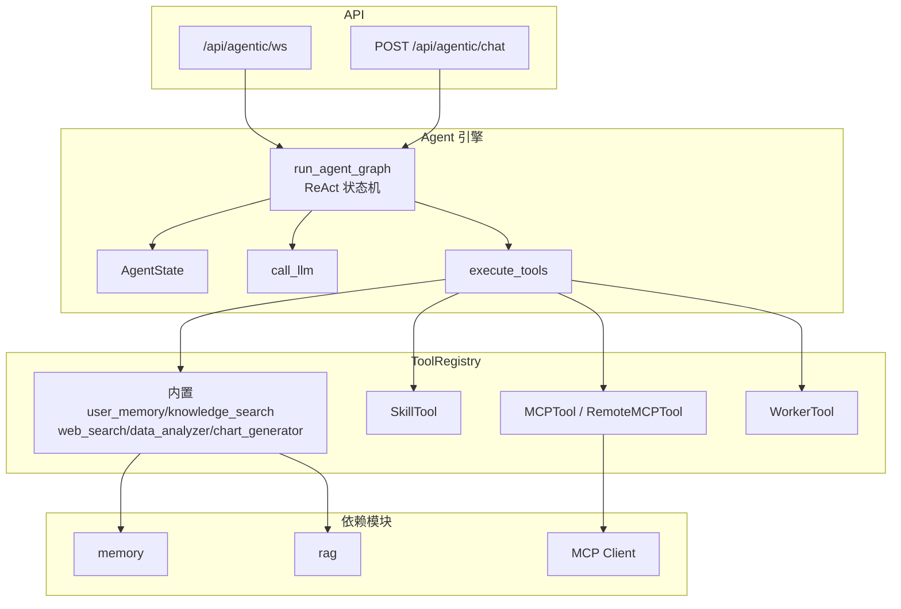

# Agentic 模块 🤖

## 快速导航

- 入口：`/api/agentic/ws`（流式） / `POST /api/agentic/chat`（非流式）
- 核心引擎：`agent_loop.py` + `agent_state.py`（ReAct 状态机 + 多步工具调用）
- 工具系统：`agentic/tools/`（一工具一文件，详见 `agentic/tools/README.md`）
- 扩展能力：SkillTool / MCPTool / RemoteMCPTool / WorkerTool
- DeepResearch：`agentic/deepresearch/`（独立研究会话流）
- 配置入口：`agentic/config.py`（模型、步数/超时、Skills、MCP Servers 等）

本目录实现了 AIWeb 的 **Agentic 模式**：在普通聊天之上，引入 ReAct 思考、工具调用、多 Agent 路由和 Skills / MCP 等扩展能力，让大模型可以像「小助手团队」一样解决复杂任务。

> 如果说普通聊天是“回答问题”，那 Agentic 更像“先想清楚，再主动去查、去算、去画、去调用别的系统”。

---

### Agentic 模块架构图



## ✨ 功能特性

- **ReAct 推理循环**
  - 使用 `AgentState` + `run_agent_graph` 构建轻量状态机，节点包括：`call_llm` / `execute_tools` / 终止节点
  - 支持 Thought / Action / Observation / Final Answer 模式，并在无工具调用时自动解析 `Thought:` / `Final Answer:` 片段
  - 提供 `on_stream_delta`、`on_thought`、`on_action`、`on_observation(_delta)`、`on_final_answer` 等回调，便于前端精细呈现推理过程

- **多步工具调用与护栏**
  - `max_steps` 与 `max_total_seconds` 双重限制，避免死循环与超长任务
  - 工具执行存在超时（`tool_timeout_seconds`），超时会转为友好 Observation 提示，而不是直接抛出 500
  - 各类错误都会被包装为 Observation 并写入 `state.errors`，最终回答会根据错误情况降级说明

- **多 Agent / 工具路由**
  - 通过 `ToolRegistry` 支持按 agent 名称划分工具集（如 `supervisor` / 领域 Worker）
  - `get_tools_schema_for(agent_name, enabled_tool_names)` 生成 OpenAI 兼容的 tools schema，并支持按前端勾选白名单过滤

- **工具系统与扩展**
  - 内置工具：`user_memory`、`knowledge_search`、`web_search`、`data_analyzer`、`chart_generator` 等
  - 扩展工具：
    - `SkillTool`：将自定义技能封装为 Tool，可通过配置或 `SKILLS/*.md` + `*.py` 自动加载
    - `MCPTool`：基于逻辑名调用远端 MCP Server 上的工具
    - `RemoteMCPTool`：在启动时自动发现 MCP Server 的全部工具并注册到 `ToolRegistry`
    - `WorkerTool`：将子 Agent 封装为标准 Tool，用于 Supervisor-Worker 架构

---

## 🗂 目录结构（backend/agentic）

- `main.py`：Agentic 专用 FastAPI 应用（可独立运行），暴露 `/api/agentic/*` 路由
- `config.py`：`AgenticSettings`、LLM / Steps / 超时配置、Skills / MCP Servers / MCP Tools 配置
- `agent_state.py`：`AgentState` / `AgentCallbacks` / `AgentDeps` 等状态与依赖定义
- `agent_loop.py`：核心 Agent Loop 与状态机执行引擎（`run_agent_graph` / `run_agentic_session`）
- `llm_client.py`：LLM 调用封装，支持带 tools schema 的普通调用与流式调用
- `tools_base.py`：Tool 抽象基类、`ToolContext`、`ToolExecutionError`
- `tools_registry.py`：工具注册中心（`ToolRegistry`），负责：
  - 注册内置工具（`register_builtins`）
  - 从配置中注册 SkillTool / MCPTool（`register_dynamic_from_settings`）
  - 从 `SKILLS/` 扫描 Markdown 技能并动态加载（`load_markdown_skills`）
- `mcp_client.py`：MCP 客户端，提供 `invoke` / `list_tools` 等基础能力
- `mcp_manager.py`：在应用启动时自动发现 MCP Servers 工具并注册为 `RemoteMCPTool`
- `SKILLS/`：技能目录（`<name>.md` + `<name>.py`，示例：`web_search`）
- `tools/`：具体工具实现目录，详见 `tools/README.md`
- `deepresearch/`：深度研究子模块，负责规划、检索、写作、审校、PDF 导出，详见 `deepresearch/README.md`

---

## 🚀 运行方式

### 与主后端一体运行（推荐）

在 `backend` 目录下，Agentic 路由已由主应用挂载，一般只需启动主后端即可：

```bash
cd backend
pip install -r requirements.txt
python main.py
# 或 uvicorn main:app --host 0.0.0.0 --port 8000
```

此时前端可直接通过 `http://localhost:8000/api/agentic/*` 访问相关接口。

如果你的 `infra/docker-compose.yml` 已经启动并让 `Attu` 占用了宿主机 `8000`，记得先解决端口冲突，再按上述方式启动后端。

### 独立运行 Agentic 服务（可选）

如果希望将 Agentic 能力拆分到独立进程，也可以单独启动：

```bash
cd backend
uvicorn agentic.main:app --host 0.0.0.0 --port 8001 --reload
```

前端可在配置中将 Agentic 接口指向独立端口（如 `http://localhost:8001/api/agentic/ws`）。

### 主要环境变量示例

```bash
export OPENAI_API_KEY="xxx"
export OPENAI_BASE_URL="https://api.openai.com/v1"  # 或你的代理地址 / 网关地址
```

如需使用联网搜索 / MCP 等工具，还需配置对应的第三方 Key，详见 `tools/README.md` 与主 `backend/README.md`。

### 当前与普通聊天的关系

- 普通聊天和 Agentic 共用用户体系、模型配置、会话历史与部分上下文恢复逻辑。
- Agentic 的推理事件流和工具调用 trace 会额外写入 Redis / 会话消息元数据，前端可在刷新后尝试恢复进行中的推理状态。
- DeepResearch 虽然位于 `agentic/` 目录下，但它走的是另一条独立会话流，不复用普通聊天的 `conversation_id`。

---

## 📡 接口与事件流

### 1. WebSocket：`/api/agentic/ws`

- URL：`ws://<backend-host>:<port>/api/agentic/ws`
- 建立连接后，先发送一条 JSON 请求：

```json
{
  "user_query": "帮我查一下那个图纸审核项目的 YOLO 模型部署在哪个服务器，顺便查一下相关文档的配置。",
  "system_prompt": "你是一个具备 ReAct 能力的企业级助手，请严格使用 Thought / Action / Observation / Final Answer 模式……",
  "model_id": "deepseek-chat",
  "user_id": 123,
  "enabled_tools": ["user_memory", "knowledge_search", "web_search"]
}
```

Agent Loop 会按步骤流式推送事件，典型序列：

```json
{ "event": "stream_delta", "content": "用" }
{ "event": "stream_delta", "content": "户" }
...
{ "event": "thought", "step": 0, "content": "用户询问了图纸审核项目中的 YOLO 模型服务器位置..." }
{ "event": "action", "step": 0, "tool": "user_memory", "parameters": {"query": "YOLO 模型部署服务器位置"} }
{ "event": "observation_delta", "step": 0, "content": "从用户长期记忆中检索到" }
{ "event": "observation", "step": 0, "content": "Observation: 记忆显示：YOLOv8 部署在 192.168.1.100 ..." }
...
{ "event": "final_answer", "content": "根据您的记忆记录...", "conversation_id": "xxx" }
```

- **事件说明**：
  - `stream_delta`：模型逐 token 输出（仅答案正文，不含工具调用）
  - `thought`：单轮完整 Thought 文本
  - `action`：工具调用信息（工具名 + 参数）
  - `observation_delta`：工具结果分块流式输出
  - `observation`：单轮完整 Observation 文本
  - `final_answer`：最终回答（整轮会话级别）

### 2. HTTP：`POST /api/agentic/chat`

适合只需要最终回答、无需展示完整推理过程的场景。

```http
POST /api/agentic/chat
Content-Type: application/json

{
  "user_query": "请帮我分析一下最近一个月收入与成本的变化趋势，并给出关键结论。",
  "system_prompt": "你是一个擅长数据分析的助手。",
  "model_id": "deepseek-chat",
  "user_id": 123,
  "enabled_tools": ["data_analyzer", "chart_generator"]
}
```

响应：

```json
{
  "content": "根据你提供的数据……（省略）",
  "model": "deepseek-chat"
}
```

---

## 🔌 Skills 与 MCP 集成

### 1. Skills（SkillTool）

- 在 `AgenticSettings.skills` 中声明要暴露给大模型的技能，每个包含：
  - `name`：工具名（LLM `tool_calls[].function.name`）
  - `description`：在 Prompt / tools schema 中展示给模型的说明
- 模块加载时，`tools_registry.register_dynamic_from_settings()` 会：
  - 为每个 SkillConfig 创建一个 `SkillTool` 实例并注册到 `ToolRegistry`
  - 如果还在 `SKILLS/` 下提供了 `<name>.md` + `<name>.py`，则由 `load_markdown_skills()` 按 Markdown frontmatter + `execute()` 函数动态加载，实现更强表达能力
- `SkillTool.run()` 中会：
  - 先进行权限检查（目前统一放行）
  - 再调用绑定的 `handler_func(**params)`，并将返回结果转为字符串返回给 Agent Loop

### 2. MCP（MCPTool 与 RemoteMCPTool）

- 在 `AgenticSettings.mcp_servers` 中声明可用的 MCP Servers（名称 / 地址 / 前缀 / 启用状态等）
- 在 `AgenticSettings.mcp_tools` 中声明静态 MCP 工具映射：
  - `name`：在 Agentic 中暴露给模型的工具名
  - `server_name`：对应某个 MCP Server 配置
  - `tool_name`：MCP Server 端真实工具名
- `MCPTool`：按上述静态配置包装远端工具，`run()` 内部通过 `MCPClient.invoke()` 调用
- `mcp_manager.discover_and_register_mcp_tools()`：
  - 在 FastAPI lifespan 中调用一次
  - 并发向所有启用的 MCP Server 调用 `list_tools`，将返回的工具包装为 `RemoteMCPTool` 自动注册
- 从模型视角看，无论是 `MCPTool` 还是 `RemoteMCPTool`，都是统一的 Tool：
  - 只需在工具调用中写 `{"name": "<tool_name>", "arguments": {...}}` 即可

---

## 🛡 步数 / 超时与错误策略

- **步数与总时长限制**
  - `AgentState.max_steps`：单次会话最大迭代步数（默认来自 `config.llm.max_steps`）
  - `AgentState.max_total_seconds`：总执行时长上限（默认来自 `config.llm.max_total_seconds`）
  - 超过任一限制时，状态机会切换到 `"force_end"`，返回一条友好的阶段性结论

- **工具执行超时**
  - `AgentDeps.tool_timeout_seconds` 控制单个工具最大执行时间
  - 超时时会生成 Observation 文本提示下游服务异常，并将错误记入 `state.errors`

- **错误包装为 Observation**
  - 工具抛出 `ToolExecutionError`：
    - 转换为形如 `Observation: 工具执行失败，错误信息：XXX。请尝试调整参数，或在无法修复时向用户解释情况。`
  - 未知异常：
    - 统一转为「未知错误」Observation，提示在最终回答中说明当前无法完成操作，而不是直接 HTTP 500

这些护栏保证了 Agentic 在复杂任务和不稳定下游依赖下仍能 **优雅失败**，并给用户一个可理解的解释。

## ⚠️ 当前限制

- `/api/models` 里的手动新增模型是进程内内存态配置，服务重启后不会自动保留。
- 工具权限控制目前仍偏轻量，更适合个人环境、内网环境或受控实验环境。
- DeepResearch 的研究模型当前固定为 `deepseek-v3.2`，并不是把前端传入的 `model_id` 原样透传到底层。

