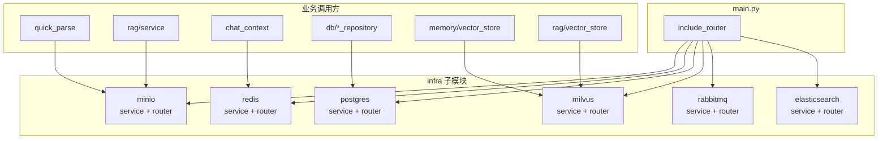

# AIWeb Backend Infra ⚙️

## 快速导航

- 分层原则：业务路由与基础设施适配分离
- 子模块约定：`service.py` + `router.py`
- 挂载方式：`main.py` 中 `include_router`
- 常见子模块：MinIO / Redis / Postgres / Milvus / RabbitMQ / Elasticsearch

本目录用于集中管理对接**外部/基础设施**的代码（如 MinIO、Redis、数据库等），  
和业务路由 `routers/`、通用业务服务 `services/` 分层，方便你在不「拆后端」的前提下疯狂扩展能力。😄

### 后端 Infra 架构图



## 🔄 实现流程

- **挂载**：在 `main.py` 中 `from infra.xxx import router` 并 `app.include_router(router, prefix="/api")`，健康检查与调试接口统一在 `/api` 下（如 `/api/redis/health`、`/api/postgres/health`）。
- **请求路径**：客户端请求 → FastAPI 路由 → 对应 infra 的 `router.py` 中的端点 → 内部调用 `service.py` 或直接访问连接池/客户端，不依赖业务模型。
- **服务层**：各子目录的 `service.py` 提供连接配置与读写逻辑，可被业务代码（如 RAG、memory、chat_context）直接复用，无需经 HTTP。

实际使用中，这一层承担两类职责：

- 供业务代码直接 import 的基础设施客户端封装
- 供开发/排障使用的健康检查与最小调试接口

## 📁 目录约定

每个子目录对应一种基础设施服务，建议结构：

```
infra/
  minio/           # MinIO 对象存储
    __init__.py
    service.py
    router.py
  redis/           # Redis 缓存
    __init__.py
    service.py
    router.py
  postgres/        # PostgreSQL 数据库
    __init__.py
    service.py
    router.py
  milvus/          # Milvus 向量数据库
    __init__.py
    service.py
    router.py
  rabbitmq/        # RabbitMQ 消息队列
    __init__.py
    service.py
    router.py
  elasticsearch/   # Elasticsearch 搜索引擎
    __init__.py
    service.py
    router.py
```

- **service / client**：连接配置、读写逻辑，不依赖 FastAPI，可在脚本/任务中直接复用。
- **router**：对外 HTTP 接口，仅在本模块内引用 service，在 `main.py` 中挂载。

## 🔌 当前主项目里谁在用这些适配层

| 适配层 | 主要调用方 | 用途 |
|--------|------------|------|
| `infra.minio` | `services/quick_parse.py`、`rag/service.py`、前端附件上传接口 | 临时文件、RAG 原文、图片对象存储 |
| `infra.redis` | `services/chat_context.py`、可能的任务队列/状态恢复 | 普通聊天流恢复、缓存、热上下文 |
| `infra.postgres` | `db/*_repository.py` | 用户、会话、消息、研究会话、记忆、RAG 元数据 |
| `infra.milvus` | `memory/vector_store.py`、`rag/vector_store.py` | 长期记忆向量、RAG Dense/Sparse 检索 |
| `infra.rabbitmq` | 预留扩展 / 调试 | 当前不是主链路刚需 |
| `infra.elasticsearch` | 预留扩展 / 调试 | 当前不是主链路刚需 |

## 🧩 在 main.py 中挂载

```python
from infra.minio import router as storage_router
from infra.redis import router as redis_router
from infra.postgres import router as postgres_router
from infra.milvus import router as milvus_router
from infra.rabbitmq import router as rabbitmq_router
from infra.elasticsearch import router as es_router
app.include_router(storage_router, prefix="/api")
app.include_router(redis_router, prefix="/api")
app.include_router(postgres_router, prefix="/api")
app.include_router(milvus_router, prefix="/api")
app.include_router(rabbitmq_router, prefix="/api")
app.include_router(es_router, prefix="/api")
```

新增服务时同理：在对应子目录实现 `router`，在 `main.py` 中 `from infra.xxx import router` 并 `include_router` 即可。  
这样一来，「加一个 Milvus」「换一个 Redis」「加一条健康检查路由」都不会污染业务代码。🚀

## 🧭 维护建议

- 业务模块需要基础设施能力时，优先直接调用 `service.py`，不要绕一圈走 HTTP。
- README 或 `.env.example` 中一旦修改了默认端口、账号、桶名，也要同步检查这里的默认值是否一致。
- 对外暴露的 `router.py` 更适合做健康检查、连通性验证、最小操作示例，不建议把复杂业务逻辑塞进 infra 层。
